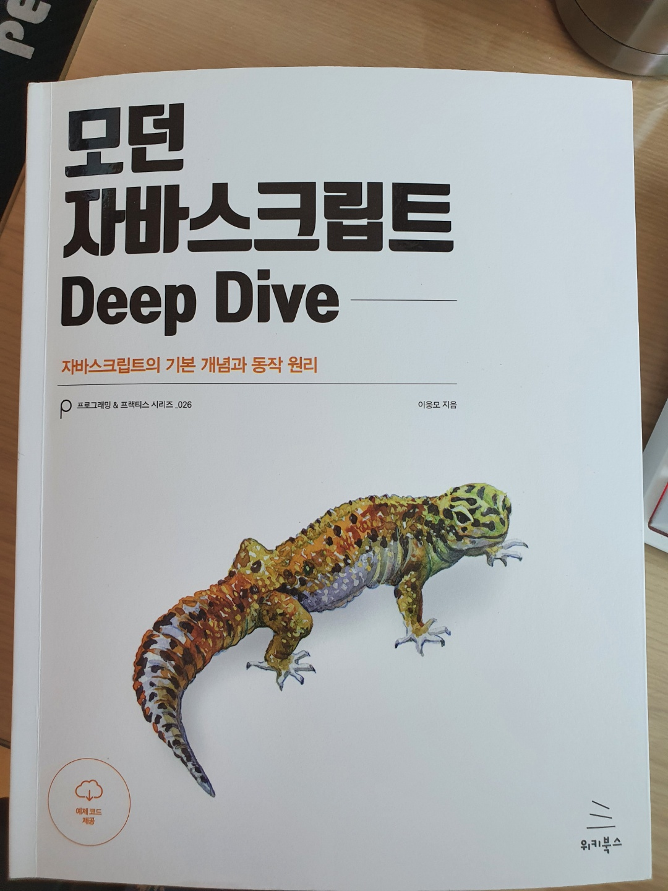

> 일요일 아침에 주문했는데 월요일 아침에 바로옴(너무좋다)
>
> JS는 프론트부터 백엔드영역까지 아우르는 팔방미인 언어임
>
> Stack Overflow의 개발자 인기언어 설문결과 1위로 선정됨(몇년째 부동의 1위로 알고있음)
>
>게다가, JS는 크로스플랫폼을 위한 가장 중요한 언어로 주목받고 있으며 웹, 모바일 하이브리드앱, 서버사이드, 머신러닝, 로보틱스까지 활용가능하기에 이 언어 하나만큼은 깊게 배우고자함
>
> 900페이지에 달하는 분량이지만 지금까지 다른공부해왔듯이 꾸준히 그리고 반복정독할 예정

